# Manual Técnico — TaskFlow + CloudDrive
## Seminario de Sistemas 1 | Práctica 2
### Universidad San Carlos de Guatemala — Facultad de Ingeniería
### Sección A | Primer Semestre 2026 | Grupo 8

---

## Datos de los Estudiantes

| Nombre | Carné |
|--------|-------|
| Johan Moises Cardona Rosales | 202201405 |
| Giovanni Saul Concoha Cax | 202100229 |
| Estiben Yair Lopez Leveron | 202204578 |

---

## Descripción de la Arquitectura

TaskFlow + CloudDrive es una aplicación web desplegada en **AWS** y **Microsoft Azure** que permite a los usuarios gestionar tareas y almacenar archivos en la nube.

### Arquitectura AWS

La arquitectura en AWS está compuesta por los siguientes servicios:

- **Amazon S3** — Aloja el frontend estático (React) y los archivos subidos por los usuarios
- **Amazon EC2** — Dos instancias que ejecutan los backends (Node.js y Python)
- **AWS Load Balancer (ALB)** — Distribuye el tráfico entre las dos instancias EC2
- **Amazon RDS (PostgreSQL)** — Base de datos relacional para usuarios, tareas y archivos
- **AWS Lambda** — Funciones serverless para subir imágenes y documentos a S3
- **Amazon API Gateway** — Expone las funciones Lambda como endpoints HTTP
- **AWS IAM** — Gestión de usuarios y políticas de seguridad por servicio

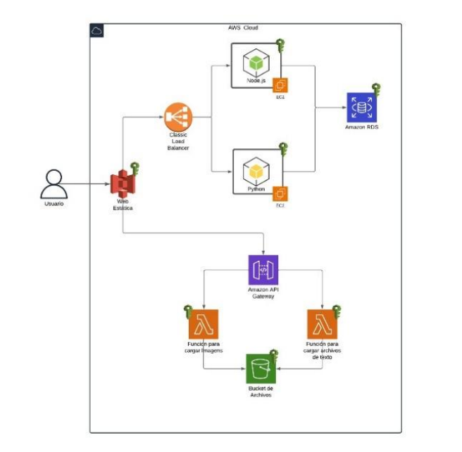

### Arquitectura Azure

> [Pendiente de configuración]

---

## Usuarios IAM y Políticas de Seguridad

### Descripción de usuarios IAM creados

| Usuario | Política Asignada | Descripción |
|---------|------------------|-------------|
| `user-s3-taskflow` | `AmazonS3FullAccess` | Acceso exclusivo a S3 para subir y obtener archivos |
| `user-ec2-taskflow` | `AmazonEC2FullAccess` | Acceso exclusivo a EC2 para gestionar instancias |
| `user-lambda-taskflow` | `AWSLambda_FullAccess`, `AmazonAPIGatewayAdministrator`, `IAMFullAccess` | Acceso a Lambda y API Gateway para funciones serverless |
| `Administrador_202204578` | Administrador general | Usuario administrador de la cuenta |

Cada usuario fue creado siguiendo el principio de **mínimo privilegio**, asignando únicamente los permisos necesarios para el servicio que administra.

### Capturas de Usuarios IAM

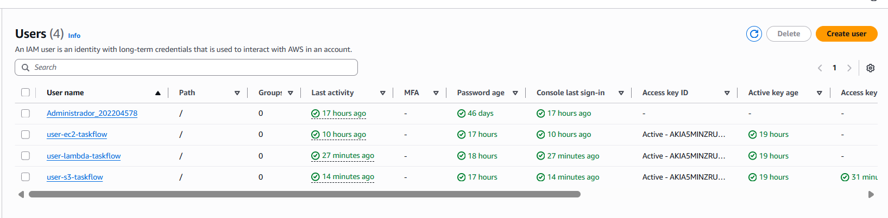

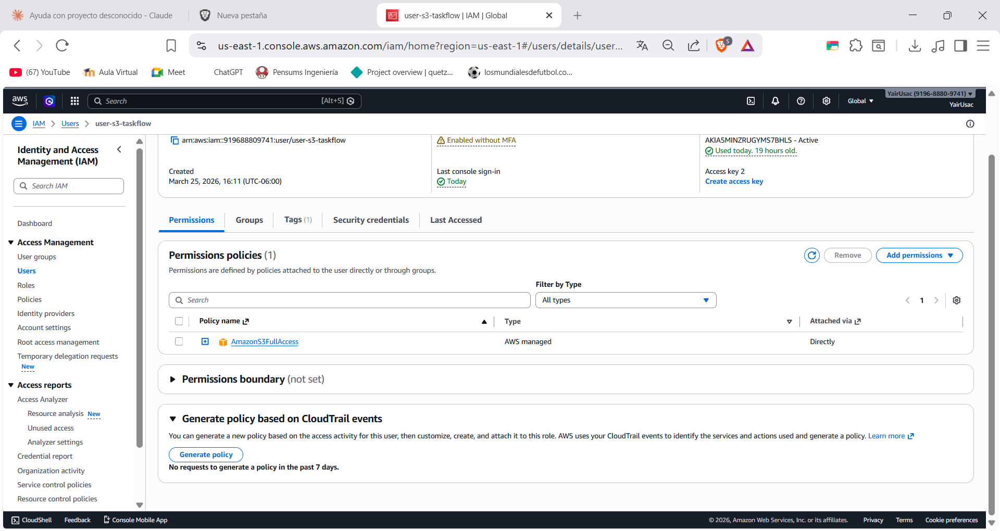

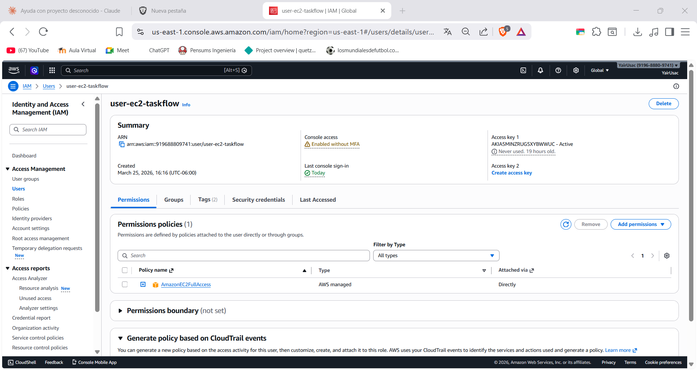

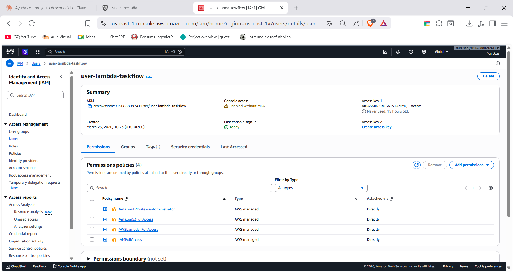

---

## Recursos AWS

### S3 — Almacenamiento

#### Bucket Frontend: `practica2semi1a1s2026paginawebg8`
- **URL del sitio web:** http://practica2semi1a1s2026paginawebg8.s3-website-us-east-1.amazonaws.com
- Configurado con **Static Website Hosting**
- Index document: `index.html`
- Error document: `index.html`
- Política pública para acceso de lectura

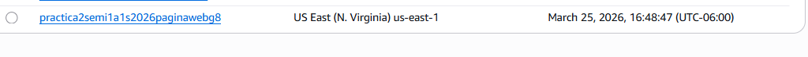

#### Bucket Archivos: `practica2semi1a1s2026archivosg8`
- **URL base:** https://practica2semi1a1s2026archivosg8.s3.us-east-1.amazonaws.com
- Almacena imágenes de perfil, imágenes y documentos de usuarios
- Política pública para acceso por URL

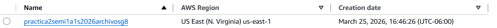

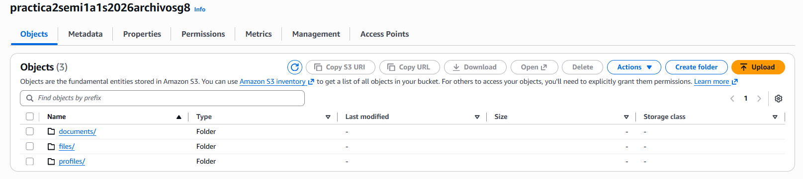

---

### EC2 — Instancias de Cómputo

#### Instancia 1 — Backend Node.js
- **Nombre:** `taskflow-node-server`
- **IP Pública:** `3.83.204.14`
- **URL:** http://3.83.204.14:3000
- **Health check:** http://3.83.204.14:3000/health
- **Tipo:** `t3.micro`
- **Sistema Operativo:** Ubuntu Server 24.04 LTS
- **Puerto:** 3000
- **Tecnología:** Node.js + Express

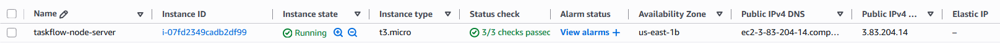

#### Instancia 2 — Backend Python
- **Nombre:** `taskflow-python-server`
- **IP Pública:** `54.166.95.9`
- **URL:** http://54.166.95.9:3000
- **Health check:** http://54.166.95.9:3000/health
- **Tipo:** `t3.micro`
- **Sistema Operativo:** Ubuntu Server 24.04 LTS
- **Puerto:** 3000
- **Tecnología:** Python + Flask + Gunicorn

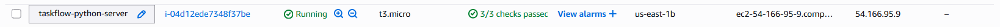

---

### Security Groups — Grupos de Seguridad

#### Security Group EC2 Node.js (`launch-wizard-1`)
| Tipo | Puerto | Origen |
|------|--------|--------|
| SSH | 22 | My IP |
| Custom TCP | 3000 | 0.0.0.0/0 |
| Custom TCP | 80 | 0.0.0.0/0 |

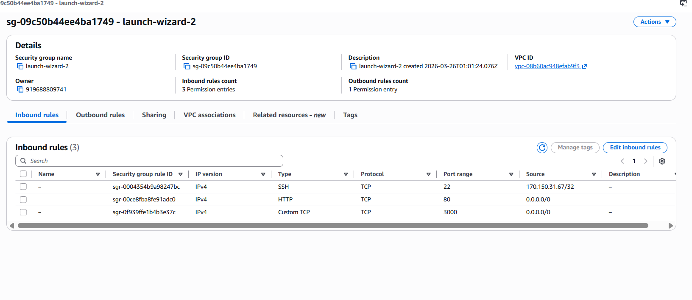

#### Security Group EC2 Python (`launch-wizard-2`)
| Tipo | Puerto | Origen |
|------|--------|--------|
| SSH | 22 | My IP |
| Custom TCP | 3000 | 0.0.0.0/0 |
| Custom TCP | 80 | 0.0.0.0/0 |

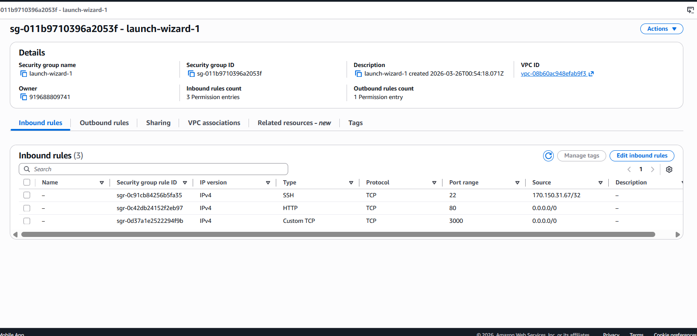

---

### Load Balancer — Balanceador de Carga

- **Nombre:** `taskflow-alb`
- **Tipo:** Application Load Balancer
- **DNS:** `taskflow-alb-345434485.us-east-1.elb.amazonaws.com`
- **URL:** http://taskflow-alb-345434485.us-east-1.elb.amazonaws.com
- **Health check:** http://taskflow-alb-345434485.us-east-1.elb.amazonaws.com/health
- **Target Group:** `taskflow-tg-3000` (puerto 3000)
- **Listener:** HTTP:80 → Forward to `taskflow-tg-3000`

**Load Balancer**

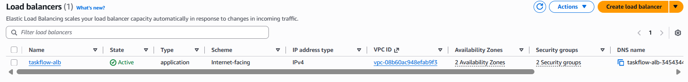

**Target Group**

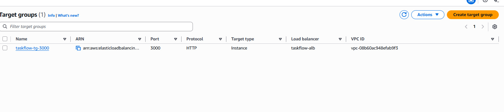

---

### RDS — Base de Datos

- **Identificador:** `taskflow-db`
- **Motor:** PostgreSQL
- **Endpoint:** `taskflow-db.c4zwoqaeo764.us-east-1.rds.amazonaws.com`
- **Puerto:** 5432
- **Conexión:** `taskflow-db.c4zwoqaeo764.us-east-1.rds.amazonaws.com:5432`
- **Tipo:** `db.t4g.micro`
- **Región:** us-east-1

#### Tablas creadas:
- `users` — Información de usuarios (contraseña encriptada con bcrypt)
- `tasks` — Tareas de los usuarios
- `files` — Metadatos de archivos (solo URL, no archivo directo)

**Instancia RDS**

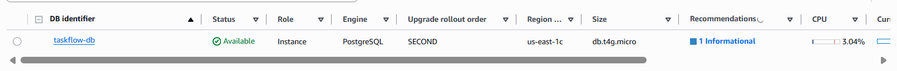

**Tablas en DBeaver**

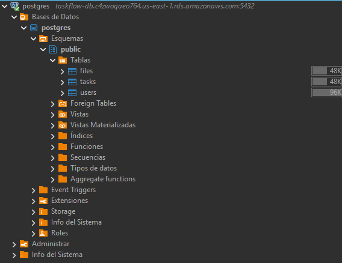

---

### Lambda — Funciones Serverless

#### Función 1: `taskflow-upload-images`
- **Runtime:** Node.js 22.x
- **Descripción:** Recibe una imagen en base64 y la sube al bucket S3 en la carpeta `images/`
- **Variables de entorno:** `BUCKET_REGION`, `S3_BUCKET`

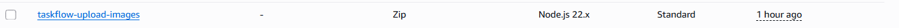

#### Función 2: `taskflow-upload-documents`
- **Runtime:** Node.js 22.x
- **Descripción:** Recibe un documento en base64 y lo sube al bucket S3 en la carpeta `documents/`
- **Variables de entorno:** `BUCKET_REGION`, `S3_BUCKET`

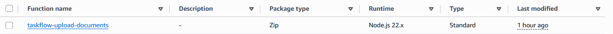

---

### API Gateway

- **Nombre:** `taskflow-api`
- **Tipo:** HTTP API
- **URL Base:** https://fokw5ov39f.execute-api.us-east-1.amazonaws.com
- **Upload imágenes:** https://fokw5ov39f.execute-api.us-east-1.amazonaws.com/upload-images
- **Upload documentos:** https://fokw5ov39f.execute-api.us-east-1.amazonaws.com/upload-documents

| Ruta | Método | Integración |
|------|--------|-------------|
| `/upload-images` | POST | `taskflow-upload-images` |
| `/upload-documents` | POST | `taskflow-upload-documents` |

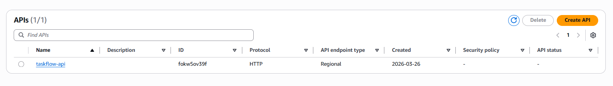

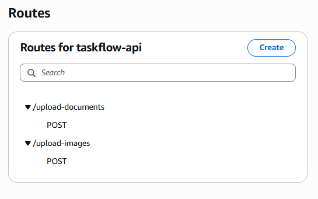

---

## Recursos Azure

### Azure VM — Máquinas Virtuales

#### VM 1 — Backend Node.js
> [Insertar captura de Azure VM Node.js]

#### VM 2 — Backend Python
> [Insertar captura de Azure VM Python]

### Azure Load Balancer
> [Insertar captura del Azure Load Balancer]

### Azure Blob Storage
> [Insertar captura del Blob Container frontend]
> [Insertar captura del Blob Container archivos]

### Azure Functions
> [Insertar captura de Azure Functions]

### Azure API Management
> [Insertar captura de Azure API Management]

---

## Conclusión — Diferencias entre AWS y Azure

### AWS
- La consola de AWS es más compleja pero ofrece mayor granularidad en la configuración
- IAM en AWS permite un control muy detallado de permisos por servicio
- Lambda + API Gateway es más sencillo de configurar que Azure Functions + API Management
- El proceso de configuración de EC2 es intuitivo con el wizard de lanzamiento

### Azure
> [Pendiente de completar tras configuración de Azure]

### Comparativa General

| Característica | AWS | Azure |
|---------------|-----|-------|
| Interfaz | Compleja pero completa | Más amigable |
| IAM/Permisos | Muy granular | Roles y políticas similares |
| Serverless | Lambda + API Gateway | Functions + API Management |
| Almacenamiento | S3 | Blob Storage |
| Cómputo | EC2 | Virtual Machines |
| Base de datos | RDS | Azure Database |
| Balanceador | ALB (Application Load Balancer) | Azure Load Balancer |

---

## Repositorio

**URL:** https://github.com/Ggi0/SEMINARIO1_A_1S2026_G8

---

*Seminario de Sistemas 1 — Sección A — Primer Semestre 2026*
*Universidad San Carlos de Guatemala — Facultad de Ingeniería*